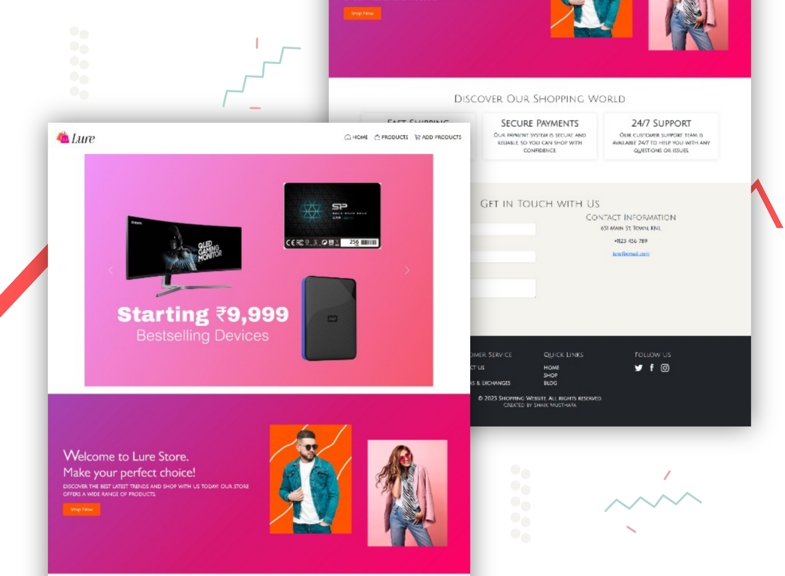

 # 🛍 Frontend Mentor - Lure Shopping landing page 

## Welcome! 👋

A responsive e-commerce landing page with product display and custom product addition features using HTML, CSS, Bootstrap, and JavaScript. This is a 3-page application that demonstrates modern web design with API integration and localStorage persistence.

📸 Preview

🏠 Home Page

📄 Product Page (API + Local Data Display)

➕ Add Product Page

🎨 Styling (style.css)

📜 Product Fetch & Display Script

📝 Add Product Script

📁 Project Structure
📦 LURE-Shopping/
├── index.html               # Home page
├── products.html            # Displays products (API & custom)
├── add product.html         # Form to add products
├── style.css                # Custom styling
├── script.js                # Fetch & display logic
├── add product.js           # Form handling & localStorage
├── /images                  # Logo, icons, and product assets
├── /images/svgs             # SVG icons used in navbar
└── /images/readme           # Screenshots for README (optional)
🔧 Features
✅ Responsive layout using Bootstrap 5.3.7

✅ Stylish hero section with animated background

✅ Bootstrap carousel for banners

✅ Discover section explaining features

✅ Contact form with validation

✅ Footer with social icons and links

✅ API data fetch from FakeStoreAPI

✅ Custom product addition with persistence using localStorage

📜 How It Works
🔹 Product Fetch (script.js)
Fetches data from FakeStore API

Stores it in localStorage on first load

Renders cards dynamically using JS DOM

🔹 Add Product (add product.js)
Reads input from form

Pushes custom product into localStorage

Products persist on page reload

🚀 Getting Started
1. Clone the repo
git clone https://github.com/mrshaik65/lure-shopping.git
cd lure-shopping
2. Open index.html in your browser to start
📦 Dependencies
Bootstrap 5.3.7

Google Fonts

FakeStoreAPI

👨‍💻 Developed By
Shaiik Musthafa
© 2025 LURE Shopping. All rights reserved.

📝 License
This project is open-source and free to use under the MIT License.